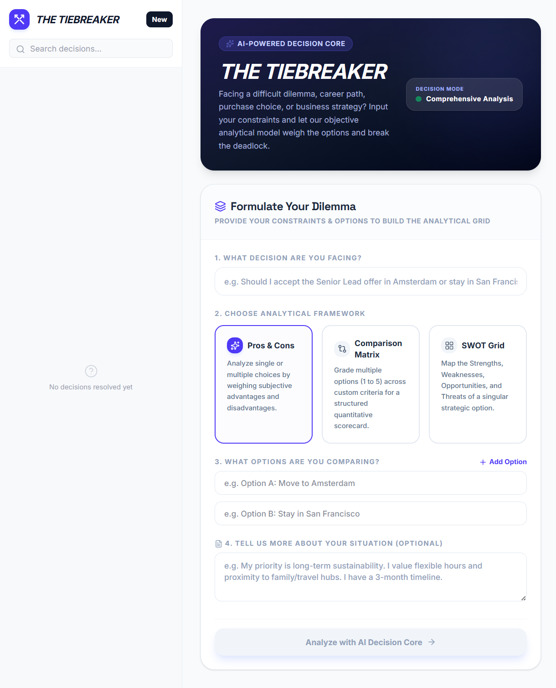

# 🏆 THE TIEBREAKER

An AI-powered decision-making assistant that helps you make better decisions using structured analytical frameworks.

This is my **first public Vibe Coding project**, built with **Google AI Studio**, **React**, **TypeScript**, and the **Google Gemini API**.

---

## ✨ Features

- ✅ AI-powered decision analysis
- ⚖️ Pros & Cons analysis
- 📊 Comparison Matrix
- 🎯 SWOT Analysis
- 🤖 Objective AI recommendations

---

## 🚀 Tech Stack

- React
- TypeScript
- Vite
- Express.js
- Google Gemini API
- Tailwind CSS

---

## 🌐 Live Demo

https://the-tiebreaker-five.vercel.app

---

## 📸 Preview
<p align="center">
  
</p>

---

## 💡 How It Works

1. Describe the decision you need to make.
2. Add the available options.
3. Choose an analysis framework.
4. Let AI evaluate your choices.
5. Receive an objective recommendation.

---

## 🛠️ Run Locally

### Prerequisites

- Node.js

### Installation

```bash
npm install
```

Create a `.env.local` file and add your Gemini API key:

```env
GEMINI_API_KEY=YOUR_API_KEY
```

Start the development server:

```bash
npm run dev
```

---

## 🎯 About This Project

The Tiebreaker was created as my **first public Vibe Coding project** to explore how AI can help people make better decisions.

The goal was to build a clean, practical application that transforms difficult choices into structured analyses using modern AI.

---

⭐ If you like this project, feel free to star the repository.
